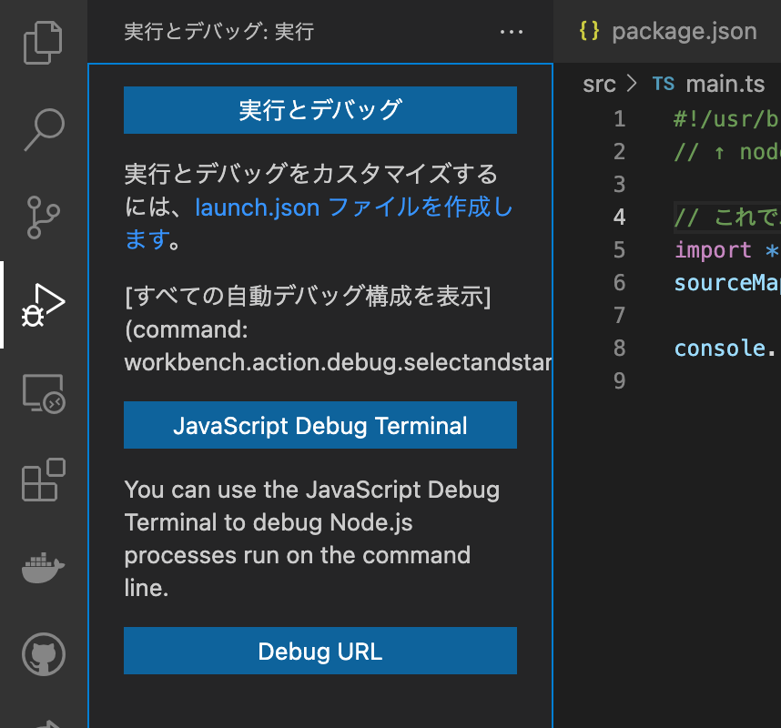
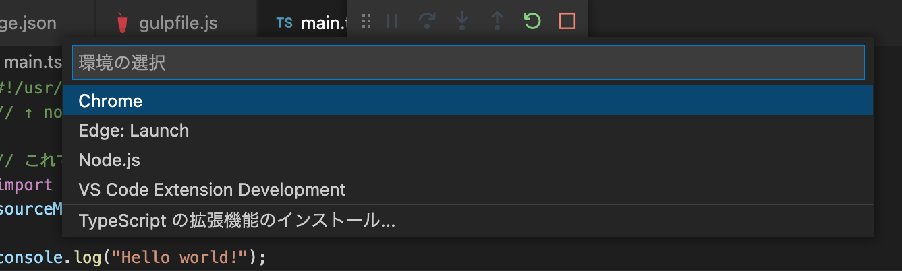
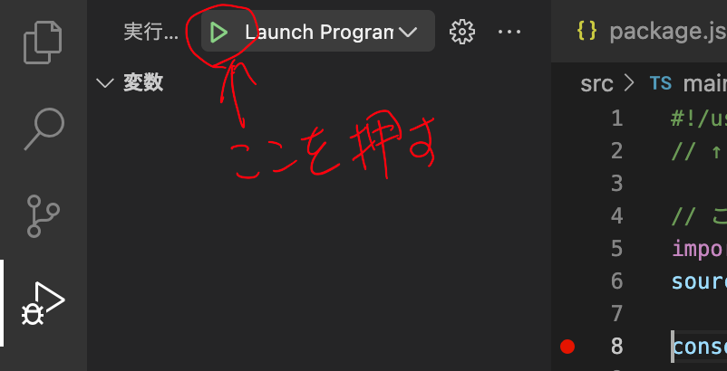

# gulpとTypeScriptとVSCodeで開発環境を用意してみた。

gulpとTypeScriptとVSCodeでコマンドラインアプリを作るための開発環境(テンプレートみたいなもの)を用意してみた。

次のページを参考にして構築してみた。

[TypeScript 3 + gulp 4 で開発環境を構築する方法](https://tt-computing.com/ts3-gulp4-install)
[Gulpのインストール方法＆使い方を解説する](https://miya-system-works.com/blog/detail/177)
[Gulp4がリリースされたのでgulpfile.jsをアップデートした](https://cloudpack.media/45655)
[TypeScriptで書いてwebpackでビルドしたjsファイルのエラーをわかりやすくする](https://qiita.com/paranishian/items/2983560350169b42b666)

## インストール
プロジェクトのフォルダをmkdirとか使って作る。ここでは"helloworld"にしとく。

helloworldに移動してpackage.jsonを作る。

~~~bash
$ npm init
~~~

質問には適当に答える。

gulpやTypeScriptやらをインストールする。

~~~bash
$ npm install gulp gulp-sourcemaps gulp-typescript typescript @types/node @types/source-map-support --save-dev
$ npm install source-map-support --save
~~~

gulp4からはgulp-soucemapsはいらないようなこと書いてあったけど、どう設定すればいいかわからなかったんで使うことにした。てか、gulp-typescriptのドキュメント見るとgulp-soucemapsを使うように書いてあった。

source-map-supportは実行時にエラーになったときなどにtsファイルのどこでエラーになったかなどが表示されるようにするのに必要。

tsconfig.jsonを作る。

~~~bash
$ npx tsc --init
~~~

## ソースを用意する。

srcフォルダを作ってそこにmain.tsを作る。

~~~typescript
#!/usr/bin/env node
// ↑ nodeで実行するために必要

// これでエラーになった時tsファイルのどこでエラーになったかがわかりやすく表示される。
import * as sourceMapSupport from "source-map-support"
sourceMapSupport.install();

console.log("Hello world!");
~~~

## 設定ファイルを用意する。
ビルドしてできあがったファイルをdistフォルダに置くこととする。

package.jsonを変更する。
- "main"を"dist/main.js"に変更する。
- "scripts"に"build"を追加する。
- npmに公開しないなら"private"をtrueにする。(ほんとにこれで大丈夫なのかは試したことない(^^;))
- "bin"を追加する。npm installしたとき"hello"というコマンドができるようにする。

~~~json
{
    ...(省略)
    
    "main": "dist/main.js",
    "private": true,
    "scripts": {
        "build": "npx gulp build",
        "start": "node dist/main.js"
    },
    "bin": {
        "hello": "dist/main.js"
    },

    ...(省略)
}
~~~

tsconfig.jsonはとりあえず変更しない。

"gulpfile.js"を作る。

~~~javascript
const { dest, src, series, watch, parallel } = require("gulp");
const ts = require("gulp-typescript");
const tsProject = ts.createProject("tsconfig.json");
const sourcemaps = require("gulp-sourcemaps");

// tsファイルを指定する。
const srcFiles = "src/**/*.ts";
// 出力先を指定する。
const destDir = "dist";

// ビルドタスク
const buildTask = (done) => {
    src(srcFiles)
        .pipe(sourcemaps.init())    // soucemapを出力する準備
        .pipe(tsProject())          // tsconfig.jsonを使用してビルド
        .on("error", (err) => {
            console.error(err);
        })
        .pipe(sourcemaps.write(".", { includeContent: false, sourceRoot: '../src' }))   // sourcemapを出力する。
        .pipe(dest(destDir));       // 出力先を指定する。
    done();
}

// ウォッチタスク
const watchTask = () => {
    watch(srcFiles, series(buildTask));
}

// npx gulp buildでビルド
exports.build = series(buildTask);
// npx gulpでソースの変更を監視してビルド
exports.default = series(watchTask);
~~~

これで"npx gulp build"でビルドでき、"npm build start"で実行できる。また、"npx gulp"でソースの変更を監視して自動でビルドするようになる。

## ビルどしたファイルをインストールする。

"sudo npm install file:."または、親ディレクトリに移って"sudo npm install file:helloworld -g"でグローバルにインストールでき、"hello"というコマンドで実行できるようになる。
アンインストールは"sudo npm uninstall helloworld -g"でできる。

## Visual Studio Codeでデバッグする。

Visual Studio Codeで"helloworld"フォルダを開く。

左にある"実行とデバッグ"を選択すると次のような画面になるので、

"launch.jsonファイルを作成します。"をクリックすると、次のような選択画面が表示されるので"Node.js"を選択する。

"launch.json"が作られるので"preLaunchTask"と"sourceMaps"を追加する。

~~~json
{
    ...(省略)

    "preLaunchTask": "npm: build",
    "sourceMaps": true,

    ...(省略)
}
~~~

main.tsにブレークポイントを設定して、デバッグの開始を押すとブレークポイントで設定した行で一時停止する。

[github](https://github.com/miyamoto999/helloworld_ts/tree/V1)にコードを投稿しておいた。